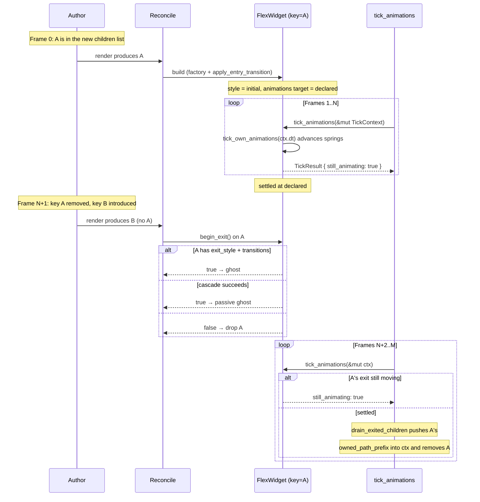

# Ogham — Widget Lifecycle (Initial / Exit / Presence)

> **Status: Live contract.**
>
> Entry animations (`initial:`), exit animations (`exit:`,
> ghosts), and the `Presence` container that sequences transitions
> between content generations. Reconciliation rules are in
> [`WIDGET_TREE.md`](WIDGET_TREE.md); the spring math driving the
> animations is in [`STYLE_AND_ANIMATION.md`](STYLE_AND_ANIMATION.md);
> keys are introduced in
> [`INTENT §5`](INTENT.md#5-reconciliation-matches-by-key-falls-back-to-position).

---

## Authority

- Entry / exit / cascade on Flex:
  [`src/widget/flex_widget.rs`](../../src/widget/flex_widget.rs)
  (`apply_entry_transition`, `begin_exit`, `cancel_exit`,
  `is_exit_complete`, `drain_exited_children`).
- Generation sequencing:
  [`src/widget/presence_widget.rs`](../../src/widget/presence_widget.rs).

---

## At a glance

```
Mount
  builder constructs FlexWidget
  factory calls apply_entry_transition()
    if initial_style && declared_style.transitions.any_enabled():
      style = initial_style
      animations.retarget(initial → declared)
  first frame renders at initial; subsequent ticks spring → declared

Live (no lifecycle event)
  hover changes, prop changes, state changes
  → tick_own_animations runs every frame an animation is active

Unmount (key disappears from new children)
  reconcile_children attempts begin_exit() on the orphan
    if exit_style && exit_style.transitions.any_enabled():
      exiting = true
      animations.retarget(rendered → exit)
      → ghost
    elif any descendant accepts begin_exit:
      exiting = true (passive ghost; cascade keeps subtree alive)
      → passive ghost
    else: drop immediately

Ghost
  remains in parent's children
  ticks each frame; once animations.is_empty() and exiting,
    drain_exited_children removes it from the parent
  pushes the dropped widget's owned_path_prefix into
    TickContext.drained_path_prefixes
  → UI promotes the prefix to UI.pending_drained_prefixes
  → next render's process_drain_queues fires owned hooks
    (on_unmount + effect cleanups under that prefix)
```

A `Presence` container layers over this with generation
sequencing — see "Presence" below.

---

## Mount: `initial:` and `apply_entry_transition`

Authoring shape:

```ogh
Flex {
  initial: { opacity: 0, transform: { translate_y: -12 } },
  style: {
    opacity: 1,
    transform: { translate_y: 0 },
    transition: { opacity: "spring", transform: "spring" },
  },
  ...
}
```

The builder (`create_flex_widget`):
1. Parses `style:` into `declared_style`.
2. If `initial:` is present, parses it (using `declared_style`
   as the base — fields not specified in `initial` keep their
   declared values) into `initial_style`.
3. Calls `apply_entry_transition()`.

`apply_entry_transition`:
- Returns immediately if `initial_style` is `None` or
  `declared_style.transitions.any_enabled()` is `false`.
- Otherwise sets `self.style = initial_style.clone()` and calls
  `animations.retarget(&initial, &target=declared_style)`.
- If the retarget produced no springs (i.e. `initial == declared`
  on every transition-enabled property), snaps to `declared` so
  layout doesn't observe a stale "initial" value.

### Tenets — entry

- **An entry animation requires both `initial:` AND a
  non-empty `transition:`.** Without the transition declaration,
  the widget snaps from `initial` to `declared` on the second
  frame — visually broken. The current code special-cases this
  by skipping the entry path if `transitions.any_enabled()` is
  false.

  *Why:* there's no inferred-default transition. Authors opt in
  by declaring `transition:` for the properties they want
  animated.

  *Drift indicators:*
  - An "auto-spring on initial" path that adds default
    transitions when `initial:` is present.
  - An entry animation running when no transition is declared
    — would feel inconsistent with hover / state-driven
    transitions, which require the same opt-in.

- **`initial:` is layered over `declared_style`, not specified
  alone.** Fields the author *doesn't* mention in `initial:`
  default to the `declared_style` value. Authors only specify
  the *delta* — typically an opacity or a translate.

  *Why:* makes the common case ("appear from above") trivial
  to write. Authors don't have to repeat every style field they
  want preserved.

  *Drift indicators:*
  - A change that treats `initial:` as a complete style with
    independent defaults. Authors would need to repeat every
    field they care about.

---

## Unmount: `exit:` and ghosts

Authoring:

```ogh
Flex {
  key: "save-button",
  exit: { opacity: 0, transform: { translate_y: -8 } },
  style: { opacity: 1, transform: { translate_y: 0 },
           transition: { opacity: "spring", transform: "spring" } },
}
```

When this widget *disappears* from the new children list (its
key is no longer present), `reconcile_children` calls
`begin_exit()`. The widget then:

1. Tries its own `exit_style`:
   - Requires `exit_style.transitions.any_enabled()`. Without
     transitions on the exit, "animate to exit" is meaningless.
   - Snapshots `old_rendered = self.style.clone()`.
   - Sets `exiting = true`.
   - Calls `animations.retarget(old_rendered, exit_style)`.
   - If at least one spring was produced, return `true`.
   - Otherwise (`exit_style` matched current rendering): roll
     back `exiting = false` and *fall through to cascade*.

2. **Cascade**: walks each child calling `begin_exit()`. If any
   child accepts (returns `true`), the parent becomes a
   *passive ghost* (`exiting = true`, no own animation). The
   subtree stays in the tree until its exiting descendants
   finish.

3. If neither own-exit nor any descendant accepts, return
   `false`. The parent (`reconcile_children`) drops the widget.

Once a widget is exiting:
- It still ticks via `tick_animations(&mut TickContext)`. Each
  tick advances its springs and recurses into its children.
- `drain_exited_children(ctx)` is called inside
  `tick_animations`; it removes any child whose
  `is_exit_complete()` is true. Before removing the child, the
  drain pushes the child's `owned_path_prefix` into
  `ctx.drained_path_prefixes` so the lifecycle-hook drain
  machinery can fire `on_unmount` / effect cleanups under that
  prefix on the next render boundary (see [RUNTIME.md →
  Lifecycle hooks and drain queues](RUNTIME.md#lifecycle-hooks-and-drain-queues-phase-2--phase-3)).
- A passive ghost reports `is_exit_complete = false` while its
  children still have running springs; once they all settle,
  it returns true and is drained.

### Tenets — exit

- **A widget needs a `key` to participate in exit animations.**
  Reconciliation matches by key; without a key, the framework
  can't tell "removal" from "reorder".
  See [INTENT §5](INTENT.md#5-reconciliation-matches-by-key-falls-back-to-position).

  *Why:* an unkeyed list of three widgets where the middle one
  is removed looks identical (from the framework's POV) to the
  third widget moving to the middle position. With the wrong
  match, you'd animate the wrong widget out.

  *Drift indicators:*
  - Exit-on-position-mismatch logic that ignores keys.
  - User-facing docs that don't make `key` mandatory in the
    exit-animation shape.

- **Cascade keeps subtrees alive when descendants animate.** A
  parent without its own `exit:` will become a passive ghost
  if any descendant's `begin_exit` returns `true`. This is what
  makes "the whole panel animates out" work without the
  parent itself declaring an exit style.

  *Why:* without the cascade, a parent with no exit style would
  be dropped immediately when removed, taking its descendants
  with it before their exit animations could play.

  *Drift indicators:*
  - A cascade change that drops parents even when descendants
    are mid-exit.
  - Children whose exits play in isolation while their parent
    has been dropped — visually broken (children appear at
    `(0,0)` because their parent's layout no longer exists).

- **Type-mismatch reconcile triggers a ghost-replace.** When
  `update` returns `!absorbed` (the new widget is a different
  type), the parent's `reconcile_children` asks the old widget
  to `begin_exit`. If it can, both old (as ghost) and new are
  inserted; if not, the old is dropped.

  *Why:* page swaps where the outgoing screen is a Flex and the
  incoming screen is a different Flex (or even an entirely
  different widget type) should still animate.

  *Drift indicators:*
  - Type-mismatch path that always drops without trying
    `begin_exit`.

- **Ghosts retain their slot.** A child marked exiting is not
  re-shuffled by `reconcile_children`; the unkeyed-cursor walk
  skips over ghosts, and orphaned ghost widgets are spliced
  back into `next` at their original index.

  *Why:* sibling layout stability mid-exit. If a ghost moved
  to the end of `children`, the rest of the layout would shift
  while the exit animation played, and the visual result would
  be chaotic.

  *Drift indicators:*
  - A reconcile change that places ghosts at the end.

- **Once exit is in flight, a re-mount cancels it.** If the
  next reconcile produces a new child whose key matches an
  exiting ghost, `reconcile_children`'s pre-pass calls
  `cancel_exit()` on the ghost. The widget then re-enters
  normal life: animations retarget toward `declared_style`
  (or `hover_style`). Cancellation cascades — a passive ghost
  whose descendants are mid-exit propagates `cancel_exit` to
  every child so the whole subtree returns to normal state
  together. The cancel pass also captures each cancelled
  widget's `owned_path_prefix` and pushes it into
  `TickContext.cancelled_unmount_prefixes` so the runtime can
  drop any pending unmount under that prefix instead of firing
  it on the next drain pass.

  *Why:* an author toggling a key off and on rapidly should see
  a smooth round-trip rather than a "kill the old, mount a
  new instance from scratch" experience. Without the
  prefix-capture, the unmount hook of a re-mounted widget
  would fire after `cancel_exit` and leave the lifecycle in an
  incoherent state (the new widget would observe the old's
  cleanup running on it).

  *Drift indicators:*
  - A reconcile that doesn't pre-check existing ghosts for
    cancel-eligible matches before key matching.
  - `cancel_exit` not cascading to descendants — passive
    ghosts whose children are exiting need their children
    canceled too.
  - A cancel path that doesn't push to
    `cancelled_unmount_prefixes` — the runtime would fire a
    pending unmount whose owning widget is back in the tree.

- **A widget that returns `true` from `begin_exit` is
  responsible for eventually returning `true` from
  `is_exit_complete`.** Otherwise the parent never drains it
  and the widget is leaked in the tree.

  *Drift indicators:*
  - A widget whose exit can never settle (e.g. a spring with
    a target it can't reach due to clamping).

---

## `Presence` — sequencing transitions between generations

Authoring:

```ogh
Presence {
  key: current_route_id,
  children: [ render_route(current_route_id) ],
}
```

When `key` changes, every child of the inner Flex begins
exiting. The new children (already evaluated by the VM in this
render — `Presence`'s children expression runs every render,
just like every other widget's) are stashed as
`pending_children` until every existing child has finished
exiting; then the pending children are committed.

### Internal state

```rust
struct PresenceWidget {
    inner: FlexWidget,                  // owns layout + the live children incl. ghosts
    generation_key: Option<String>,     // current generation
    pending_children: Option<Vec<WidgetRef>>,
    pending_key: Option<String>,
}
```

### Update flow

`PresenceWidget::update(new)`:

1. Downcast `new` to `PresenceWidget`. If type mismatch, return
   `REPLACE`.
2. **Same key**: reconcile children normally via inner.
   If a transition was in flight (`pending_children.is_some()`),
   call `cancel_pending` first — author reverted the key
   mid-exit; unwind the in-flight exits.
3. **Different key**:
   a. If no transition is in flight, call
      `begin_exit_on_current` to start exits on the current
      children (drops any that can't ghost).
   b. Stash `new.children` as `pending_children`, `new.key` as
      `pending_key`.
   c. If the outgoing content had nothing to animate
      (`inner.children` is empty after `begin_exit_on_current`),
      commit pending right away.

### Tick flow

`PresenceWidget::tick_animations(&mut TickContext)`:
1. Calls `inner.tick_animations(ctx)` (which advances springs
   and drains exit-complete children, pushing their
   `owned_path_prefix`s into `ctx.drained_path_prefixes`).
2. If `pending_children` is set and `inner.children` is empty,
   commit pending: swap pending into inner.children, set
   `generation_key = pending_key`, request layout + repaint.

### Tenets — Presence

- **Latest pending wins on rapid key changes.** A → B → C
  while A is still exiting: B's pending children are *replaced*
  by C's. The exit on A continues; once it settles, C mounts
  (B never appears).

  *Why:* if every key change started a fresh exit cycle, rapid
  key flicker would queue exits unboundedly. Latest-wins keeps
  the user's intent — they ended up on C, that's where they
  should arrive.

  *Drift indicators:*
  - A queue-based pending model that mounts B before C.
  - Exits being restarted on every key change (would cancel
    in-flight A exit and break the visual flow).

- **Reverting the key cancels in-flight exits.** A → B → A
  while A is still exiting: pending B is dropped; existing
  exiting children have `cancel_exit` called on them. The A
  child returns to its declared style smoothly.

  *Why:* a route revert (user clicks "back" mid-transition)
  should feel like the transition reversed, not like a fresh
  mount.

  *Drift indicators:*
  - A revert path that drops pending without canceling
    exits — exiting A children would still animate out and
    then snap back, visually doubled.

- **`Presence` itself has no own exit animation.** When a
  parent removes a `Presence`, the Presence's `begin_exit`
  drops `pending_children` (since they would never become
  visible) and forwards to `inner.begin_exit` so any current
  generation's children exit normally.

  *Drift indicators:*
  - A Presence with its own `exit_style` field that the
    cascade doesn't honor.
  - Pending children outliving the Presence's removal.

- **Generation separation between siblings is per-Presence.** A
  page that has both a sidebar route and a main-panel route
  needs *two* `Presence`s — one wrapping each — so that the
  sidebar's exit doesn't gate the main panel's enter.

  *Drift indicators:*
  - A "global Presence" feature that synchronizes all
    transitions.
  - Documentation that suggests one Presence per route hierarchy
    instead of per slot.

- **`Presence` delegates everything except update + tick to
  its inner Flex.** Layout, render, hit-testing, hover, scroll
  all go through the inner. Don't re-implement these on Presence.

  *Drift indicators:*
  - Presence growing its own layout / hit-testing.

---

## Combined timeline



---

## Tests

`presence_widget.rs` has acceptance tests for:
- Initial mount (no pending state).
- Key change without exit capability → immediate swap.
- Key change with exits → ghost held, pending committed when
  ghosts settle.
- Rapid key changes → pending is replaced latest-wins.
- Reverting key mid-exit → pending dropped, exits unwound.

`flex_widget.rs` has a few keyed-reorder tests but doesn't
exhaustively cover the cascade + exit interactions.

---

## Open questions (for the design-review phase)

- **Cascade cancellation isn't symmetric.** A passive ghost
  whose descendants finish exiting transitions to
  `is_exit_complete = true` and is drained. But during the
  ghost's life, children that *aren't* exiting still tick
  normally — including their own springs that the ghost-state
  isn't pausing. Authors with hover state on a ghost's
  descendants can see hover animations still playing on a
  visually-leaving subtree.
- **Re-mount during exit cancels but doesn't restore animation
  velocity.** `cancel_exit` retargets toward `declared_style`
  with current values, which is right; but the pre-existing
  spring-velocity context (if any) is the *exit-direction*
  velocity. Authors might want a different easing on the way
  back.
- **`Presence` renders via inner Flex** which is fully
  configured (Grow on both axes, no styling). Authors who want
  a styled Presence (background, padding) have to wrap it in
  another Flex. Could expose Presence's inner styling.
- **`Presence`'s pending children evaluate every render even
  when not visible.** This is just a side effect of "render
  produces the entire descriptor tree" — the new `children`
  expression runs on every render. For expensive children
  (e.g. routes that fetch data), this is wasteful. A way to
  lazily evaluate pending might help.
- **`begin_exit` returns `bool` rather than enum.** "I have my
  own exit", "I'm a passive ghost", and "I can't ghost" collapse
  to the same `bool`. Diagnostics or future cancellation logic
  might want to distinguish.
- **Stuck springs: layout-affecting exit animations that fight
  with new content's layout can loop forever.** A ghost taking
  300 ms to opacity-out while pending content forces relayouts
  on the parent each frame: each relayout re-measures the
  ghost's rect, but if the ghost's springs are stable, this
  doesn't cascade. Edge cases where the ghost's rect *isn't*
  stable (margin/padding springs interacting with parent layout
  changes) are not formally tested.
- **No way to pause / resume exit animations.** An author who
  wants an exit to wait for an async operation (e.g. "save
  before navigating") has to do it before triggering the
  Presence key change.
- **Initial / exit / hover / target style precedence:**
  `target_style()` returns `exit_style` if exiting; else
  `hover_style` if hovered; else `declared_style`. This means
  hovering a widget mid-exit produces no visual change (still
  pulls toward exit). Probably right; document.
