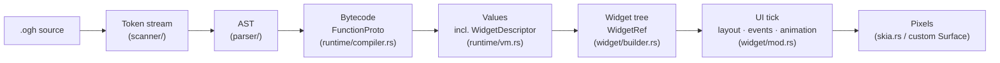
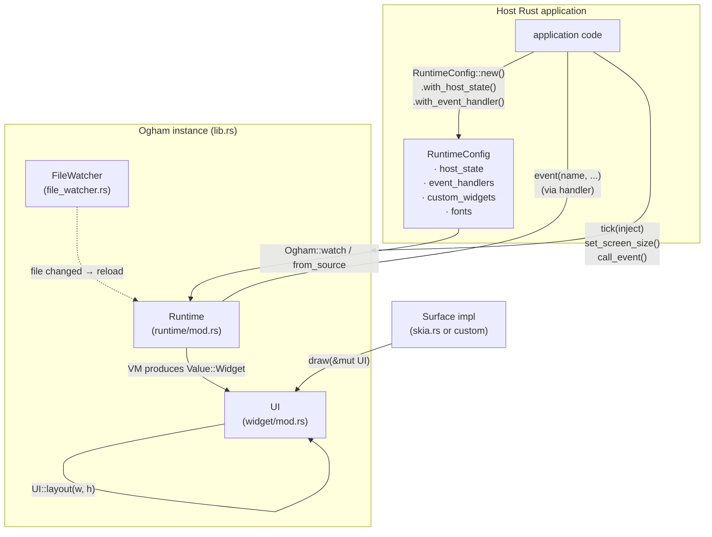
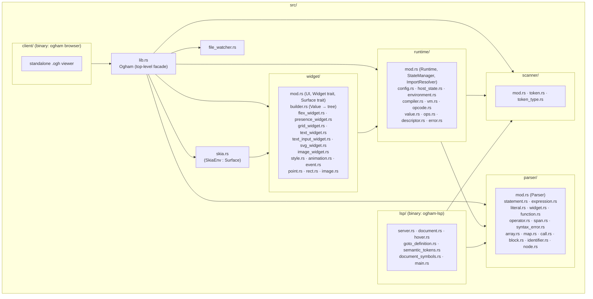
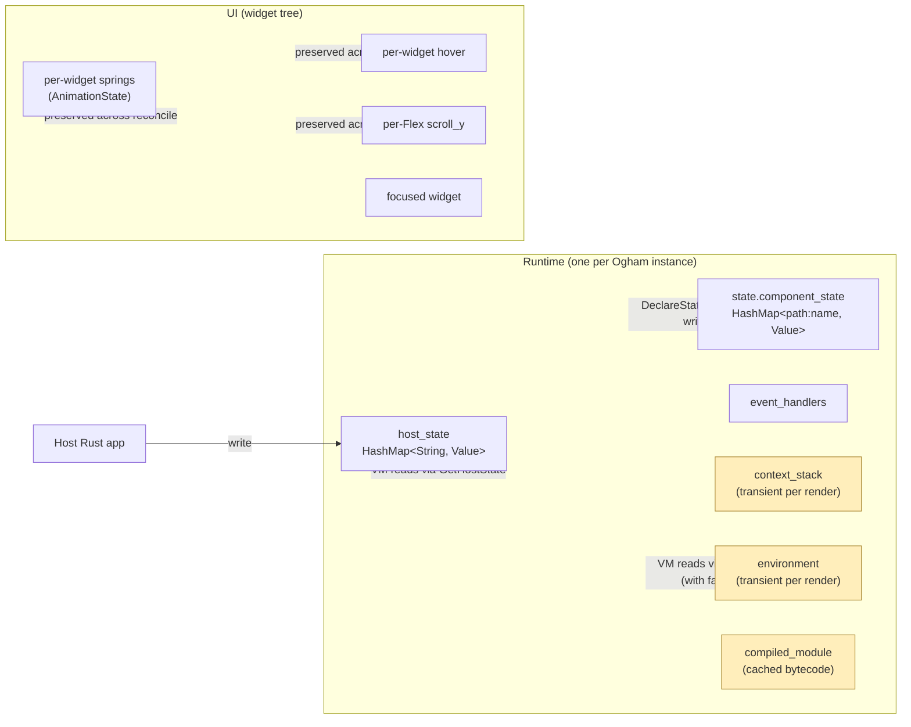

# Ogham — Architecture at a Glance

> **Status: Live contract.**
>
> A one-page orientation. Each diagram answers a question someone
> new to the codebase tends to ask in their first hour. The detail
> lives in the documents this one points at; this page is for the
> picture-shaped answers.
>
> If a diagram contradicts code, the code is the more reliable
> source — but flag the discrepancy. The same drift discipline
> that governs `INTENT.md` applies here.

## 1. The pipeline



Each arrow is a one-way dependency. The compiler doesn't see
runtime state; the VM doesn't construct widget trees; the builder
doesn't see AST; the surface doesn't mutate the tree. This is
load-bearing — see [INTENT §1](INTENT.md#1-the-pipeline-is-four-distinct-passes-not-three).

**Read next:** [`LANGUAGE.md`](LANGUAGE.md) for scanner+parser,
[`VM.md`](VM.md) for compiler+VM, [`WIDGET_TREE.md`](WIDGET_TREE.md)
for builder+reconciliation.

## 2. Embedding



Host writes; Ogham reads. From the `.ogh` side, host state is
observable but immutable; mutations leave as `event(...)` calls
the host's registered handlers receive. See
[INTENT §2](INTENT.md#2-host-state-flows-in-events-flow-out) and
[`RUNTIME.md`](RUNTIME.md).

The `tick(inject)` callback is the canonical per-frame seam: the
host pushes the current frame's state into the runtime via the
`inject` closure; `tick` then checks for file changes, runs the
injection, and reconciles the tree if a rerender is pending. Returns
`true` if the tree was reconciled.

## 3. Per-frame loop

```mermaid
sequenceDiagram
    autonumber
    participant Host
    participant Ogham
    participant RT as Runtime
    participant UI
    participant SF as Surface

    Host->>Ogham: tick(inject)
    Ogham->>Ogham: file_watcher.check_for_changes()
    alt watcher reports change
        Ogham->>RT: reload (fresh Runtime from disk)
    end
    Ogham->>RT: inject(&mut runtime) — host state push
    Note over RT: set_host_state diffs;<br/>request_rerender if changed
    Ogham->>RT: needs_rerender()?
    alt yes
        RT->>RT: rerender() → Value::Widget
        Ogham->>UI: reconcile(new_root)
        UI-->>Ogham: UpdateResult { needs_layout, needs_repaint }
    end
    Host->>Ogham: tick_animations(dt)
    Ogham->>UI: tick_animations(dt) — springs + smooth scroll
    Host->>Ogham: layout(w, h)
    Ogham->>UI: UI::layout(w, h) — runs only if dirty
    Host->>SF: draw(&mut ui)
    SF->>UI: walk tree, calling Widget::render
```

Three independent dirty signals reach the UI: rerenders
(`mark_needs_layout`), event handling (`mark_dirty`), and
animation ticks. Each can request a layout pass; debug builds
attribute layout calls per source so a chronic over-marking
regression shows up as a per-second warning.

**Read next:** [`WIDGET_TREE.md`](WIDGET_TREE.md) for what
`reconcile` actually does, [`STYLE_AND_ANIMATION.md`](STYLE_AND_ANIMATION.md)
for `tick_animations`, [`SURFACE.md`](SURFACE.md) for the draw seam.

## 4. Module layout



The LSP depends on `scanner` and `parser` only — never on
`runtime` or `widget`. That's the seam that keeps it cheap and
side-effect-free; see [LSP.md](LSP.md) and
[INTENT §1](INTENT.md#1-the-pipeline-is-four-distinct-passes-not-three).

## 5. Where state lives



Yellow boxes are derived/transient and rebuilt every render (the
environment and context stack are cleared at the start of every
module execution; the compiled module is cached but invalidated
when the source changes). Everything else persists across
rerenders — that persistence is what makes spring animations and
state-driven UI work.

**Watch out:** `Ogham::reload` and `recompile_from_source` build
a *new* `Runtime`, so component state is dropped on hot reload.
Widget tree state survives because it lives on the `UI`, which
reconciles against the new descriptors. See
[INTENT §7](INTENT.md#7-hot-reload-preserves-what-it-can-drops-what-it-cant).
