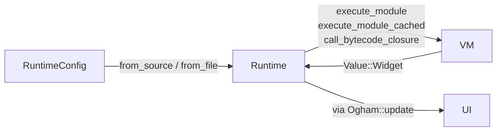

# Ogham — Runtime, Configuration, Host Integration

> **Status: Live contract.**
>
> The `Runtime` struct, `RuntimeConfig`, host-state injection,
> event handlers, and the rerender lifecycle. This doc is for
> contributors changing the `Ogham` ↔ host seam. The bytecode VM
> that runs *inside* the runtime is in [`VM.md`](VM.md); the
> widget tree the runtime hands off to is in
> [`WIDGET_TREE.md`](WIDGET_TREE.md).

---

## At a glance



`Runtime` owns the long-lived state: host state, event handlers,
component state, the import cache, the compiled module cache,
the widget registry, the prelude bindings, the screen size, and
the transient context stack. `Ogham` (in `lib.rs`) owns *the*
`Arc<Mutex<Runtime>>` plus the `UI`.

**Authority:**
- Runtime: [`src/runtime/mod.rs`](../../src/runtime/mod.rs).
- Config: [`src/runtime/config.rs`](../../src/runtime/config.rs).
- Host-state helpers:
  [`src/runtime/host_state.rs`](../../src/runtime/host_state.rs).
- Top-level facade: [`src/lib.rs`](../../src/lib.rs).

---

## RuntimeConfig

A builder that holds the host's wishes before the runtime is
constructed. Default-constructable; each `with_*` method returns
`self`. Cloned into the `Runtime` at construction; held on the
`Ogham` instance after to support reload.

Fields (each is `pub` and may also be set without the builder):
- `host_state: Option<HashMap<String, Value>>` — initial state
  injected before the first module execution.
- `event_handlers: HashMap<String, Arc<dyn Fn(&[Value]) ->
  Result<Value, String> + Send + Sync>>` — the host's
  `event(name, ...)` recipients. `Send + Sync` so the runtime
  can be wrapped in `Arc<Mutex<...>>` and shared across threads.
- `project_root: Option<PathBuf>` — base directory used for
  resolving `import` paths without a prefix.
- `import_paths: HashMap<String, PathBuf>` — prefix → directory
  shortcuts (e.g. `"@ui/"` → `/path/to/components/`).
- `fonts: Vec<FontEntry>` and `default_font: Option<String>` —
  registered families and the family applied to text widgets
  that don't specify one.
- `custom_widgets: HashMap<String, WidgetFactory>` —
  host-registered widget types. Names are lowercased so lookup is
  case-insensitive; collisions override built-ins.

### Tenets

- **The config is consumed at construction; mutating it later
  has no effect on the running runtime.** `Ogham::watch` /
  `from_source` clone the config into the runtime. Hot reload
  reuses the *original* config (cloned again), not a freshly
  mutated one — `set_default_font` / `register_font` on the
  `Ogham` instance after construction modify the live UI but
  not the saved config.

  *Why:* keeps reload deterministic. If the config could be
  mutated, two reloads in quick succession could observe
  different behavior depending on which mutations happened in
  between.

  *Drift indicators:*
  - A `with_*` method that takes `&mut self`.
  - Reload paths that read from a runtime-local mutated copy of
    the config instead of the saved `self.config`.

- **Custom widgets get the same `(registry, runtime,
  descriptor)` tuple as built-ins.** No second-class API for
  third-party widgets. The factory closure is called from the
  builder; it receives the registry so it can build child
  widgets, the runtime for closure invocation (e.g. to wire up
  event listeners), and the descriptor with the user's
  properties.

  *Why:* a custom widget that needs to run user-supplied
  callbacks (think `<Button on_click=...>`) needs the same
  closure-dispatch mechanism the built-in `Flex` uses. Forcing
  third-party widgets to roll their own would defeat the point.

  *Drift indicators:*
  - A second registry for "host widgets" with a different
    factory signature.
  - Custom widgets that bypass the registry to construct
    children directly.

---

## Runtime construction

Two entry points, both ultimately routing through `from_source`:

- `Runtime::from_file(path, config)` — reads the file, calls
  `from_source`, then sets `project_root` to the file's parent
  directory if the config didn't already specify one.
- `Runtime::from_source(source, config)`:
  1. Scan + parse the source into a `Function`.
  2. Construct a fresh `Runtime`.
  3. Run `execute_prelude` (compiles `let rgb = ...; let rgba =
     ...;` and lifts the resulting bindings into `host_state`).
     A prelude error logs and is otherwise ignored — the rest of
     the runtime continues.
  4. Apply the config: copy initial host state, register event
     handlers, set project root + import paths, copy custom
     widgets into `widget_registry`.
  5. Store the parsed module on the runtime via `set_module`
     (which also invalidates `compiled_module`).

Note that **the module is not executed during construction**. The
first execution is triggered by the calling code: `Ogham::watch` /
`from_source` calls `Runtime::execute_module(module)` from
`create_ui_from_runtime` to produce the initial widget value.

### Tenets

- **The prelude runs once at construction and lifts its bindings
  into host state.** It is *not* re-run on hot reload (a fresh
  `Runtime` is built, which re-runs it implicitly).

  *Why:* the prelude is a small fixed source. Running it once at
  construction means user code can rely on `rgb` and `rgba`
  being defined from frame zero. Lifting into host state means
  the per-render `environment` reset doesn't drop them.

  *Drift indicators:*
  - A prelude that grows large enough that re-running it on
    every reload becomes noticeable.
  - A prelude that depends on host state set later in
    `from_source` — order matters; today the prelude sees no
    host state.

---

## The rerender lifecycle

```
Ogham::tick(inject)
  ├─ check_for_changes() → reload() if true
  ├─ inject(&mut runtime)        — host state push
  └─ update()
        ├─ runtime.needs_rerender()? → no, return false
        ├─ runtime.rerender()        → fresh Value::Widget
        ├─ widget_value_to_widget_ref(...)  — builder
        ├─ ui.reconcile(new_root)    → UpdateResult
        └─ ui.mark_needs_layout/repaint as needed
```

Three things drive the `needs_rerender` flag:

1. `request_rerender()` called explicitly. The VM's `SetState`,
   `Call` over `BoundTrigger`, and `set_host_state*` (when the
   value differs) all do this.
2. Hot reload — the new runtime's `from_source` doesn't request a
   rerender directly, but `Ogham::reload_file` swaps in the new
   `UI` it just built, which `mark_needs_layout`s on construction.
3. Animation ticks dirty the `UI` directly, not via the runtime.

### `Runtime::rerender`

Resets the per-render scratch: clears `environment` (so all
top-level bindings are re-defined by the module body),
`active_state_paths`, `call_stack`, `call_counters`, the import
loading stack, and the context stack. It does **not** clear:
`host_state`, `state.component_state`, `event_handlers`,
`compiled_module`, or `widget_registry`.

Imports are *not* re-loaded from disk on rerender — the
`imports.cache` and `imports.loaded` sets are preserved. Hot
reload bypasses this by constructing a fresh runtime entirely.

### Tenets

- **Diff-on-write for host state.** `set_host_state` and
  `inject_host_state_batch` only insert and only request a
  rerender when the new value differs from the stored one.
  Frame-rate injection from a host whose state hasn't changed
  is free.

  *Why:* Untold Lore (the largest known consumer) injects
  several keys per frame from struct fields. Without diffing,
  the runtime would rerender every frame regardless of changes,
  defeating the dirty-tracking the UI does.

  *Drift indicators:*
  - A new host-state writer that bypasses the diff.
  - `request_rerender` calls from places that don't actually
    change observable state.

- **`emit_event` returns `Ok(Value::Void)` for unregistered
  handlers.** Fire-and-forget `event(...)` from `.ogh` always
  succeeds; only mutations carry the host's `Err(...)` back to
  user code.

  *Why:* it's normal during development (and after refactors)
  for the host not to handle every event the UI emits.
  Returning an error would force authors to wrap every
  `event(...)` in a no-op pattern. The mutation path is opt-in;
  authors who care about success/failure use `mutation("name")`.

  *Drift indicators:*
  - Logging or panicking on missing handlers.
  - A separate "strict" mode for unregistered events — the
    correct fix is for authors to use mutations when they need
    error feedback.

- **`Runtime` is `!Send` internally; embedders wrap it.** The
  VM uses `Rc<RefCell<...>>` for closures and mutations. The
  outer `Arc<Mutex<Runtime>>` (held by `Ogham`) is what makes
  the whole thing thread-safe to *share*; the runtime itself
  doesn't pretend to be lock-free or concurrently usable.

  *Why:* single-threaded interior simplifies VM bookkeeping
  (especially upvalues). Multi-threaded UIs are not a goal
  Ogham is solving for; if the embedder needs cross-thread
  access, it locks the mutex briefly and clones values out.

  *Drift indicators:*
  - `Send`/`Sync` impls on internal VM types.
  - A second runtime instantiated in a different thread sharing
    state with the first.

---

## State management (StateManager)

Component state — `state name = ...;` declarations — lives in
`Runtime::state.component_state`, keyed by call-stack path. See
[SUBSYSTEMS.md → State management](SUBSYSTEMS.md#state-management-component-state)
for the load-bearing rules and drift indicators.

The piece that matters at the runtime level: `rerender` clears
`active_state_paths` and `call_stack`, then runs the module,
then calls `cleanup_unmounted_state` to drop any keys whose path
wasn't visited this render. Top-level state (empty path) is
always considered active.

---

## Imports

`execute_import` is called from `OpCode::Import`. It:

1. Resolves the path: explicit prefix wins; otherwise joined
   onto `project_root`. Missing extension → `.ogh`. The result
   is canonicalized for cache keys.
2. Cycle-checks against `imports.loading_stack`.
3. If already loaded, copies cached exports into the current
   environment (named imports verify the named export exists;
   unnamed imports take everything).
4. Otherwise: read the file, scan + parse, compile via
   `Compiler::compile_import` (which also returns the
   local-name → slot table), spin up a *fresh* `VM` to evaluate
   the imported module, and read the exports off the VM stack
   via `read_stack_locals`.
5. Cache the resulting `Environment`, copy the requested names
   into the current `environment`, drop the loading-stack entry,
   add to `loaded`.

The cache is keyed by canonical path, so two imports of the same
file with different relative paths share the cache.

### Tenets

- **Imports run in a fresh `VM`.** The current VM keeps its
  stack and frame state intact. The fresh VM gets the same
  `&mut Runtime`, so component state, host state, and the
  context stack are visible to the imported module — but its
  stack frames are independent.

  *Why:* a single VM running both the importing and the
  imported module would corrupt slot indices (the import's
  top-level locals would land at non-zero slots) and would
  require the compiler to emit module-relative slot adjustments.
  Spinning up a child VM per import is the simpler model.

- **Imports lift exports into `host_state` after the import
  runs.** The VM's `OpCode::Import` handler, after calling
  `runtime.execute_import`, walks `runtime.environment`'s
  top-level bindings and injects them into `host_state` via
  `inject_host_state` (no diff). This is the one internal
  exception to the host-state-read-only rule (`INTENT §2`).

  *Why:* the running module's VM looks up free identifiers
  through `GetState`, which falls through to host state.
  Imported bindings need to be findable through that path.

  *Drift indicators:*
  - An import path that bypasses the host-state lift and
    relies on the environment alone — which would work for the
    importing module but fail at any closure invocation that
    re-enters the runtime later (event listeners), because
    those paths don't see the original environment.

---

## Event handler dispatch

Two callable shapes from `.ogh`:

1. **`event(name, ...args)`**: fire-and-forget. Compiler emits
   `EmitEvent(arg_count)`; VM pops args (first is name), calls
   `runtime.emit_event(&name, &rest)`, ignores the result, pushes
   `Void`. Handler errors are silently dropped.

2. **`mutation("name").trigger(...args)`**: tracked. Compiler
   emits `CreateMutation`, then a property access `trigger` on
   that mutation (handled in `OpCode::GetProperty`'s `Mutation`
   arm) producing a `BoundTrigger`. Calling a `BoundTrigger`
   short-circuits in `OpCode::Call` to invoke
   `runtime.emit_event` and writes the `Ok(value)` /
   `Err(message)` result back into the mutation's
   `MutationState`. A rerender is requested unconditionally.

The mutation's properties — `status`, `pending`, `data`, `error`,
`trigger` — are computed in `OpCode::GetProperty` (for
`Mutation`); `data` is the raw `Ok(value)` from the handler.

### Tenets

- **Mutations are the only way to read handler results.**
  `event(...)` discards the return value. If a `.ogh` author
  needs to know whether a handler succeeded, they have to use a
  mutation.

  *Why:* see `INTENT §2`. Synchronous handler→VM data flow
  would break the host-state-read-only rule. Mutations preserve
  the rule by storing the result on a handle the VM observes
  on the *next* render.

  *Drift indicators:*
  - A new opcode that calls a handler and pushes its result
    onto the stack synchronously.
  - `event()` returning the handler's result.

- **A mutation handle's identity persists across triggers.**
  `Value::Mutation(Rc<RefCell<MutationState>>)` is shared by
  reference; multiple `state` reads of the same mutation see
  the same handle. `PartialEq` on mutations is `Rc::ptr_eq`,
  so two `mutation("foo")` calls produce *distinct* handles.

  *Drift indicators:*
  - A `MutationState` that gets cloned (deep-copied) when read
    from `state`. Today's design relies on the `Rc` aliasing.

---

## Frame seam (`Ogham::tick`)

```rust
ogham.tick(|rt| {
    rt.set_host_state("player_health", player.health);
    rt.set_host_state("inventory_count", inventory.len() as i32);
    if state_changed_in_some_other_way {
        rt.request_rerender();
    }
});
```

`tick` is the only host-side API that does the file-watch +
host-inject + rerender + reconcile dance in one call. Returns
`true` if a rerender ran.

If you don't want the file watcher (e.g. the app is shipping a
bundled `.ogh` source), use `Ogham::from_source`, which doesn't
construct a watcher; `check_for_changes` is then a no-op.

### Tenets

- **Layout is decoupled from `tick`.** The host calls
  `set_screen_size` (or `ui.layout(w, h)` directly) when the
  window changes size. `tick` doesn't trigger layout — it only
  reconciles. This lets the host run `tick` at a different
  cadence than layout/draw if it wants to.

  *Drift indicators:*
  - `Ogham::tick` calling `ui.layout` internally.
  - Layout being driven by `request_rerender`.

---

## Reload behavior

`Ogham::reload` (called when the file watcher fires, or
explicitly by the host):

1. Build a fresh `Runtime::from_file(path, self.config.clone())`.
2. Build a fresh `UI` from that runtime's first execution.
3. Carry the existing font collection and default font onto the
   new `UI`.
4. Replace `self.runtime` and `self.ui`.

What this *does* preserve:
- Host configuration (cloned from the original config).
- Font collection and default font (carried explicitly).

What this *doesn't* preserve:
- Component state (lives on the old runtime, dropped).
- Widget tree state — strictly speaking, the *new* UI is a fresh
  tree, so springs, hover, scroll all reset. (Hot reload here
  is heavier than reconciliation against the same runtime.)

This is the trade-off recorded in
[INTENT §7](INTENT.md#7-hot-reload-preserves-what-it-can-drops-what-it-cant).
A future change could reconcile the *new builder output* against
the *existing UI* instead of rebuilding the UI; that would
preserve animation/hover state across reload at the cost of more
edge cases when shapes diverge.

---

## Open questions (for the design-review phase)

- **Why does `set_host_state` request a rerender but
  `set_state` from `.ogh` already requested one in the VM?** Two
  paths into the same flag. Audit whether both are needed or
  whether one can be the canonical writer.
- **`emit_event` swallows errors for fire-and-forget.** A
  developer with a typo'd handler name has nothing to debug.
  Could be opt-in logging behind a debug flag.
- **`request_rerender` granularity is per-runtime, not
  per-component.** Anything that triggers a rerender re-runs the
  whole module. React-shaped systems usually invalidate per
  component subtree. Worth interrogating once the module bodies
  get big enough that re-execution cost matters.
- **The reload path drops widget tree state.** Reconciling the
  builder output against the live UI would preserve animation
  state across reload. The risk is shape divergence, which the
  current "fresh UI" path sidesteps. Hard to evaluate without
  use cases.
- **The prelude is read-only and global.** No way to add
  per-application prelude bindings. Workaround: registered host
  state. Future: an opt-in prelude extension via
  `RuntimeConfig::with_prelude(source)`.
- **Closure invocation re-locks the runtime mutex per call.**
  Event handlers built from `.ogh` closures call
  `Runtime::call_bytecode_closure` which spawns a fresh VM
  inside the lock. A burst of UI events all firing handlers in
  the same frame serializes through that lock. For game-style
  UIs running at 60+ Hz this might matter; should be measured.
- **Custom widgets receive the runtime by `Arc<Mutex<...>>`.**
  This is the same lock the per-frame `update` already holds.
  A custom widget that needs the runtime mid-render would
  deadlock. Document or restructure.
